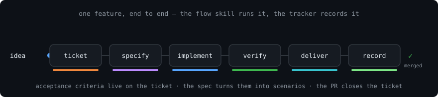
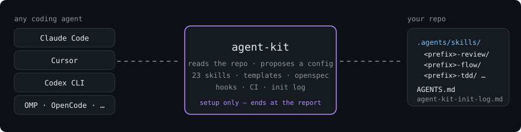
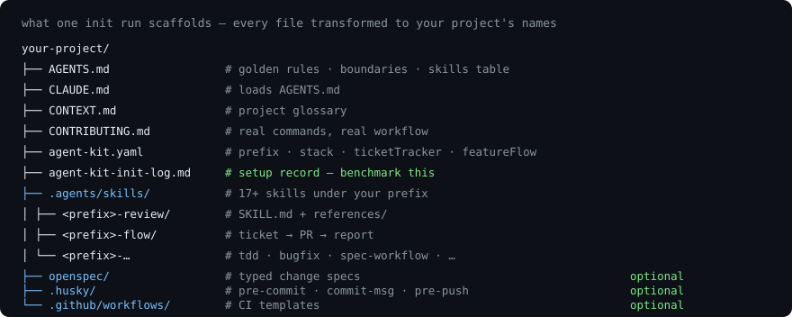
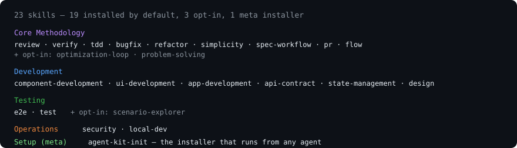

# Agent Kit

<p align="center">
  
</p>

A reusable agent-driven development methodology — 23 process skills, instruction templates, specifications, and tooling — extracted from production use and adoptable in any software project, by any coding agent.

| Part | For | Content |
|---|---|---|
| **[Part 1 — Setup guide](#part-1--setup-guide-for-agents)** | **Agents** executing setup | Exact steps, prompts, commands, and file layout — complete and literal |
| **[Part 2 — Overview](#part-2--overview-for-humans)** | **Humans** evaluating the kit | What it does, what lands in your repo, the philosophy — short and visual |

---

## Part 1 — Setup guide (for agents)

> This part is written to be executed. Follow it top to bottom. Every path is
> relative to the project being set up.

### 1. Get the kit into the project

```bash
# Clone and copy the kit directory
git clone https://github.com/dnd288/agent-kit.git /tmp/agent-kit
cp -r /tmp/agent-kit/cli/kit /path/to/your-project/.agent-kit-source
```

Or add it as a git submodule:

```bash
git submodule add https://github.com/dnd288/agent-kit.git .agent-kit
```

### 2. Run the init skill

Tell your coding agent:

> Read the skill at `.agent-kit-source/skills/agent-kit-init/SKILL.md` and
> follow its procedure to initialize agent-kit in this project.

The agent will:

1. **Detect** — stack, package manager, monorepo layout, ticket tracker (GitHub
   remote + `gh` CLI → `github`, otherwise ask), existing setup
2. **Confirm** — present the detected config and ask about: optional modules
   (OpenSpec, Claude Code, git hooks, CI), optional skills, the project's
   **ticket tracker** (`none` / `github` / `jira` / `linear`), and the
   **end-to-end feature flow** (does feature work start with a ticket? what
   happens between ticket and PR?)
3. **Scaffold** — copy each skill **directory recursively** (SKILL.md +
   `references/` + templates), transform placeholders and skill-name prefixes,
   write root templates, optional modules, and `agent-kit.yaml`
4. **Report** — write `agent-kit-init-log.md` (setup record, used for
   benchmarking) and print a summary

**Guardrail:** the init skill is setup-only. It ends at the report — it never
continues into implementing your project's features unless you explicitly ask
for that as a separate task.

**Step 3 — clean up the source (optional):** after initialization the kit
source is no longer needed:

```bash
rm -rf .agent-kit-source   # or remove the submodule
```

#### Agent-specific prompts

<details>
<summary><strong>Claude Code</strong></summary>

```
Read .agent-kit-source/skills/agent-kit-init/SKILL.md and initialize agent-kit in this project.
```

Or, if installed as a skill: `/agent-kit-init`

</details>

<details>
<summary><strong>Codex / OpenAI Codex CLI</strong></summary>

```bash
codex "Read the skill file at .agent-kit-source/skills/agent-kit-init/SKILL.md and follow its procedure to set up agent-kit in this project."
```

</details>

<details>
<summary><strong>OMP / OpenCode / other agents</strong></summary>

```
Please read .agent-kit-source/skills/agent-kit-init/SKILL.md and execute
the initialization procedure for this project.
```

Any agent that can read markdown, scan a directory tree, and write files can
run the init skill.

</details>

### 3. Alternative — via the CLI

A Go CLI is available for scripted or non-agent workflows:

```bash
# From source
cd cli && go build -o agent-kit && mv agent-kit /usr/local/bin/
```

```bash
cd your-project
agent-kit init            # interactive
agent-kit init --yes      # defaults + auto-detection, non-interactive
```

The CLI asks for project name, prefix, package manager, stack, modules, ticket
tracker, and feature flow. `--yes` answers everything from detection.

### 4. After setup

```bash
agent-kit add security    # install an additional skill
agent-kit list            # list available skills by category
agent-kit validate        # check kit integrity (registry ↔ directories, references)
```

Via an agent instead: ask it to read the `agent-kit-init` skill's add
procedure.

### 5. What gets generated

```
your-project/
├── AGENTS.md                    # Golden rules + project boundaries
├── CLAUDE.md                    # Loads AGENTS.md
├── CONTRIBUTING.md              # Development workflow
├── CONTEXT.md                   # Project glossary
├── agent-kit.yaml               # Configuration (prefix, stack, tracker, flow)
├── agent-kit-init-log.md        # Setup record: what was installed, how long it took
├── .agents/skills/              # Tool-neutral skills
│   ├── <prefix>-review/
│   ├── <prefix>-verify/
│   ├── <prefix>-tdd/
│   └── ...
├── .claude/                     # Claude Code integration (optional)
│   ├── skills/                  # Symlinks → .agents/skills/
│   ├── agents/                  # Agent definitions
│   └── workflows/               # Multi-agent orchestration
├── openspec/                    # Spec-driven development (optional)
│   ├── config.yaml
│   └── schemas/
├── .husky/                      # Git hooks (optional)
└── .github/workflows/           # CI templates (optional)
```

Skills install **whole directories** — every installed SKILL.md's relative
pointers (e.g. a `references/` guide, a sibling skill's document) resolve after
installing. If a relative path dangles, the install was partial: re-copy the
full source directory.

### 6. Repo structure

```
agent-kit/
├── cli/
│   ├── kit/                     # The methodology content
│   │   ├── skills/              # 23 process skills + init meta-skill
│   │   │   ├── e2e/
│   │   │   │   ├── SKILL.md     # Authoring and healing rules
│   │   │   │   ├── references/  # config-guide, authoring, healing
│   │   │   │   └── templates/   # playwright-bdd scaffold (21 files)
│   │   │   └── .../             # Other skills (SKILL.md + optional references/)
│   │   ├── templates/           # Root instruction templates
│   │   ├── claude/              # Claude Code integration
│   │   ├── openspec/            # Specification schemas
│   │   ├── hooks/               # Git hook templates
│   │   ├── ci/                  # CI workflow templates
│   │   └── docs/                # Methodology documentation
│   ├── cmd/                     # CLI commands (Go)
│   └── internal/                # CLI internals
├── docs/images/                 # Diagrams used by this README
└── examples/                    # Example output
```

### 7. Using installed skills

Installed skills live under `.agents/skills/<prefix>-<skill-name>/SKILL.md`.
Tell your coding agent to load and follow a skill when performing the
corresponding task:

```
# Run the whole feature pipeline
Load the <prefix>-flow skill and take issue #123 end to end.

# Code review
Load the <prefix>-review skill and review the current diff.

# Bug fix
Load the <prefix>-bugfix skill and fix the issue described in #123.

# TDD
Load the <prefix>-tdd skill and implement the feature described in the spec.

# Security review
Load the <prefix>-security skill and audit the changes on this branch.

# Create a PR
Load the <prefix>-pr skill and open a pull request for this branch.
```

For Claude Code, skills in `.claude/skills/` are auto-discovered — the agent
loads them based on the trigger text in the `description` frontmatter field.
For other agents, point them to the `.agents/skills/` directory or the specific
skill file.

### 8. Skill catalogue

#### Core Methodology

| Skill | Owns |
|---|---|
| `review` | Five-axis code review gate |
| `verify` | Adversarial CLAIM→EXTRACT→DOUBT→RECONCILE→STOP verification |
| `tdd` | RED→GREEN discipline with mode-to-claim mapping |
| `bugfix` | inspect→debug→impact→fix→verify loop |
| `refactor` | MEASURE→PIN→MOVE→PROVE→RECORD loop |
| `simplicity` | Simplest-sufficient-shape decision — the rung ladder |
| `spec-workflow` | Typed changes with end-to-end-first ordering |
| `pr` | Five PR types with checklists |
| `flow` | End-to-end feature pipeline — ticket → specify → implement → verify → deliver → record, synced with the project's tracker |
| `optimization-loop` | BASELINE→CHANGE→MEASURE→KEEP-OR-REVERT performance loop *(optional)* |
| `problem-solving` | Impasse techniques and the dev-note handed to the user *(optional)* |

#### Development

| Skill | Owns |
|---|---|
| `component-development` | Primitive component patterns |
| `ui-development` | Feature-folder composite patterns |
| `app-development` | Application routing and data flow |
| `api-contract` | Schema-first API design |
| `state-management` | State placement decision ladder |
| `design` | Design system methodology |

#### Testing

| Skill | Owns |
|---|---|
| `e2e` | End-to-end test authoring and healing — includes [scaffold templates](#9-e2e-scaffold-templates) |
| `test` | Test mode taxonomy and operational runbook |
| `scenario-explorer` | Enumerate the case space before writing tests *(optional)* |

#### Operations

| Skill | Owns |
|---|---|
| `security` | Surface-aware security review |
| `local-dev` | Local development environment setup |

#### Setup (meta)

| Skill | Owns |
|---|---|
| `agent-kit-init` | Initialize Agent Kit via any coding agent |

> Meta skills are used from the kit source tree and are not scaffolded into
> target projects.

### 9. E2E scaffold templates

The `e2e` skill ships scaffold templates under
[`cli/kit/skills/e2e/templates/`](cli/kit/skills/e2e/templates/) — a working
[playwright-bdd](https://github.com/vitalets/playwright-bdd) skeleton generalized
from a production suite (200+ scenarios, 36 features). When `agent-kit add e2e`
runs, the init agent copies these into your project's e2e path and replaces
`your …` placeholders with actual values.

#### What the scaffold gives you

| Concern | File(s) | What it does |
|---|---|---|
| **BDD config** | `playwright.config.ts` | `defineBddConfig` with `missingSteps: 'fail-on-gen'` and `aiFix.promptAttachment`, 4 reporters, seed + flows projects, webServer array |
| **Dependencies** | `package.json` | `playwright-bdd ^9.2`, `@playwright/test ^1.50`, scripts for bddgen, test, and reports |
| **Seed through API** | `seed.setup.ts` | Signs in as the bootstrap operator, POSTs to the admin seed endpoint, polls for completion |
| **Run-scope guard** | `run-scope.reporter.ts` | Warns before a run exceeding 30 scenarios — "this is the pre-merge run, not the loop" |
| **Test instance** | `fixtures/index.ts` | `mergeTests(bdd, suite)` (not spreading), typed `ScenarioWorld` with guards, POM fixtures |
| **Tag hooks** | `steps/hooks.ts` | `@journey`→120s, `@generation`→420s, `@known-issue` skip with env-var escape hatch |
| **Starter steps** | `steps/health.steps.ts` | Given/When/Then for the health feature — the first green run |
| **Starter POM** | `pom/sign-in.page.ts` | Sign-in page object with locator-reasoning comments |
| **Address isolation** | `lib/suite.ts` | Per-test `x-forwarded-for` via carrier-grade NAT (100.64.0.0/10) so the rate limiter sees each test at its own address |
| **Seeded identities** | `lib/accounts.ts` | Bootstrap operator from env vars, 4 demo accounts |
| **API origin** | `lib/api.ts` | Configurable `API_ORIGIN` and `apiHealthUrl()` |
| **Health feature** | `features/cross-cutting/health.feature` | 4 cheapest claims: app root, sign-in, API health, client health |
| **7 directories** | `features/{journeys,roles,internal,capabilities,cross-cutting,defects,known-issues}/` | Pre-created with placement rules |
| **Placement rules** | `AGENTS.md` | The 5-layer split, 7-directory placement question, import-depth rules |
| **Inventory** | `README.md` | Running-a-slice selectors, layout, tag vocabulary, project tables |
| **Ignores** | `.gitignore` | `.features-gen/`, `reports/`, `playwright-report/`, `test-results/` |

#### Design decisions

These are **opinionated defaults**, not suggestions — each earned its place in a
production suite:

- **`missingSteps: 'fail-on-gen'`** — a Gherkin sentence with no step definition
  fails `bddgen` before any browser starts, rather than producing a confusing
  runtime error.
- **`aiFix.promptAttachment`** — every failure carries the feature, the step, that
  step's source, and the page's ARIA snapshot as a ready-made prompt.
- **One worker locally, four on CI** — keeps the local loop fast and deterministic;
  no per-worker database isolation needed.
- **Seed through API, not a script** — the suite proves the application can populate
  itself through its own admin surface.
- **Per-test address isolation** — carrier-grade NAT space gives each test its own
  `x-forwarded-for`, so a credential-stuffing guard doesn't kill the suite halfway
  through.
- **`mergeTests(bdd, suite)`, never spreading** — spreading silently drops auto
  fixtures; `mergeTests` preserves them.

#### Customizing after scaffold

Every `.ts` template uses `your …` prose placeholders (same style as the `.md`
files). The init agent replaces them with your project's actual values. After
scaffolding:

1. Replace health endpoint URLs in `steps/health.steps.ts` and `lib/api.ts`
2. Replace sign-in locators in `pom/sign-in.page.ts` with your actual form
3. Replace the seed endpoint in `seed.setup.ts` with your admin API
4. Replace the `webServer` commands in `playwright.config.ts` with your actual
   start commands
5. Set `BOOTSTRAP_ADMIN_EMAIL` and `BOOTSTRAP_ADMIN_PASSWORD` env vars
6. Run `npx bddgen && npx playwright test` — the health feature should go green

The annotated config-guide reference at
[`cli/kit/skills/e2e/references/config-guide.md`](cli/kit/skills/e2e/references/config-guide.md)
explains every `playwright.config.ts` setting — what it does, why the value was
chosen, and what breaks when it's wrong.

#### The five-layer split

```
features/<split>/*.feature   →  Gherkin (business language, business outcomes)
steps/*.steps.ts             →  Given/When/Then implementations + assertions
pom/*.page.ts                →  Locators, waits, and reasoning behind each
fixtures/index.ts            →  Page objects and per-scenario world
lib/*.ts                     →  Identities, API origin, address isolation
```

**A step never constructs a page object** (takes it as a fixture), **a page object
never asserts a business outcome** (only its own preconditions), **a feature file
names no selector, URL, status code or id**, and **state moves through `world`,
never module-level variables.**

#### The seven feature directories

| Directory | A scenario goes here when its failure means… |
|---|---|
| `journeys/` | A user's end-to-end path through the product is broken |
| `roles/` | A permission boundary is wrong |
| `internal/` | An internal/admin surface is broken |
| `capabilities/` | One capability, tested in isolation, doesn't work |
| `cross-cutting/` | Infrastructure the whole suite depends on is down |
| `defects/` | A confirmed bug's regression test |
| `known-issues/` | Behaviour that hasn't been built yet |

---

## Part 2 — Overview (for humans)

### Any agent, one methodology

Agent Kit is not a framework your code depends on — it is a set of *procedures*
your coding agent follows. Review gates, TDD loops, spec workflows, PR
conventions: written down as skills, installed into your repo, and executed by
whatever agent you already use.

<p align="center">
  
</p>

### What lands in your repo

One init run. No runtime dependency, nothing to deploy — just markdown
procedures beside your code, plus optional OpenSpec schemas, git hooks, and CI
templates. A setup log records exactly what was installed, so runs can be
compared over time.

<p align="center">
  
</p>

### How a feature flows

The `flow` skill runs one pipeline per feature and keeps your issue tracker —
GitHub Issues, Jira, Linear, or none — as the single record of what is
happening and why. Stages are project configuration, decided at setup.

<p align="center">
  
</p>

### The philosophy

**Compound engineering: the codebase gets simpler as the product gets larger.**

1. Leave it easier to change than you found it
2. A new abstraction earns its place by deleting
3. Two is a coincidence; three is a missing abstraction — and the abstraction replaces all three
4. Delete the special case; do not flag it
5. An exception is written down and bounded, or it becomes the rule

Skills route, documents own rules: a skill names the procedure and points at
the document that owns the principle. Specifications come before code; claims
are verified against them, adversarially. The full treatment:
[cli/kit/docs/philosophy.md](cli/kit/docs/philosophy.md).

## License

MIT
